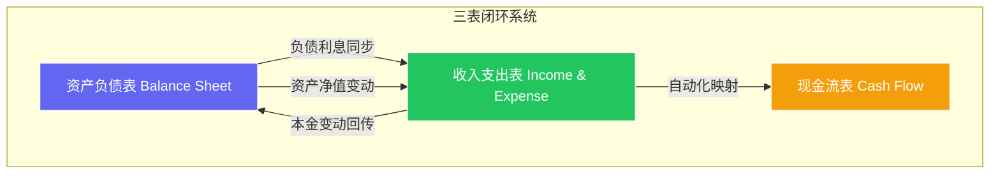

# CashFlow App (家庭/个人数字财务报表系统)


这是一个基于 **Spring Boot 3** 和 **Vue 3** 构建的专业级财务管理系统。与普通的记账软件不同，CashFlow 深度融入了**会计学原理**，通过资产负债表、收入支出表与现金流表的“三表联动”，为用户提供真实、精确的财富数字化管理方案。

---

## 🎨 核心设计理念

项目的灵魂在于**资产与负债的清晰界定**，以及**存量与流量的逻辑闭环**。

### 1. 三表联动逻辑 (Three-Table Linkage)

系统核心采用会计准则中的“联动”模型，确保财务数据的逻辑一致性：



### 2. 精准的利息与本金分离

系统在处理负债（如贷款）时，严格遵循会计准则：

- **本金偿还**：视为负债的减少（资产负债表变动），不计入现金流支出总额。
- **利息支付**：视为纯粹的费用消耗（收入支出表变动），是现金流支出的核心组成部分。

---

## 🚀 核心功能特性

- **🌀 智能同步引擎**：
  - 在资产负债表修改负债利息，收入支出表实时通过 `name` 匹配感知。
  - 在收入支出表点击利息标记，现金流计算引擎自动将其纳入月度支出明细。
- **📊 动态可视化分析**：
  - 基于 **ECharts 6** 实现的财务分析图表。
  - 支持收入构成、支出构成、资产占比、负债比例等多维度饼图展示。
- **📈 自动现金流核算**：
  - 系统根据收入支出表数据，自动剔除“资产转移”类项目（如买入股票、定投基金本金）。
  - 精准计算 **月度现金流 = 月总收入 - (生活支出 + 借款利息 + 非本金支出)**。
- **📚 智慧金融百科**：
  - 内置 **Glossary (词汇表)**，提供复利、流动资产、投资负债等财务术语的深度解析。
- **✨ 极致视觉体验**：
  - **WealthParticles**：首页动态粒子特效，营造高端理财氛围。
  - **玻璃拟态 (Glassmorphism)**：全站暗黑模式深度优化，提供呼吸感的交互体验。

---

## 🛠 技术实现细节

### 后端技术栈 (Java)

- **核心引擎**: Spring Boot 3.4.1 (Java 17)
- **安全体系**: RESTful API + **JWT (JJWT 0.12.3)** 实现现代身份认证。
- **数据持久化**: Spring Data JPA + MySQL 8.0。
- **业务逻辑**: 实现了复杂的财务计算引擎，支持负债金额与利息额的动态映射。

### 前端技术栈 (Vue)

- **架构方案**: Vue 3 + Vite 7。
- **状态管理**: **Pinia** 集中管理 `financeStore`，实现跨页面的实时数据流转。
- **可视化**: `vue-echarts` 集成支持。
- **路由逻辑**: 路由卫士结合 JWT 实现精细的 Auth 访问控制。

---

## 📂 项目结构

```text
cashflow-app/
├── cashflow/              # 后端服务 (Spring Boot)
│   ├── src/main/java/     # 业务代码 (Controller, Entity, Repository, Service)
│   ├── src/main/resources/# 资源配置与认证策略
│   └── pom.xml            # Maven 依赖配置
├── fronted/               # 前端应用 (Vue 3 + Vite)
│   ├── src/
│   │   ├── api/           # Axios 接口封装
│   │   ├── components/    # 通用组件 (AppLayout, WealthParticles)
│   │   ├── stores/        # Pinia 状态中心 (auth.js, finance.js)
│   │   ├── views/         # 业务视图 (Dashboard, 三表视图, 图表, 百科)
│   │   └── router/        # 路由配置
│   └── package.json       # 前端依赖
└── 需求文档.md             # 原始设计白皮书
```

---

## 📖 快速上手

### 环境准备

- **JDK 17+**
- **Node.js 18+**
- **MySQL 8.0+**

### 启动步骤

1. **数据库配置**：在 `cashflow/src/main/resources/application.yml` 中配置您的数据库连接。
2. **启动后端**：`cd cashflow && mvn spring-boot:run`
3. **启动前端**：`cd fronted && npm install && npm run dev`
4. **即刻使用**：访问 `http://localhost:5173`。

---

## 🤝 贡献与反馈

如果您有任何关于会计逻辑或功能优化的建议，欢迎提交 Issue。
_愿每一位用户都能通过清晰的账目，实现财富自由。_
